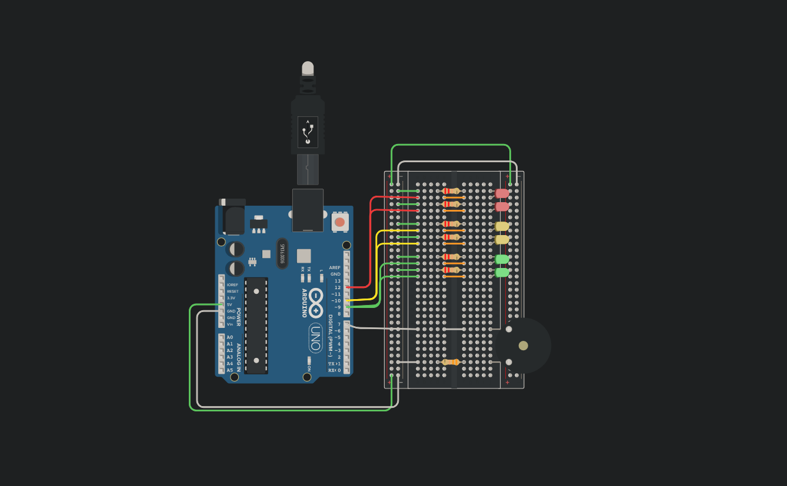

### Integrantes
* Figueroa Fernando

## Proyecto: Dojo numero 1



### Descripcion

La empresa “ScaraRobotics” nos pidio hacer una actualizacion low cost de los semaforos de la ciudad.

### Funcion principal

Void PrendeYApagaLed() es una funcion que recibe parametros para trabajarlos con un Bucle for dentro .El bucle for me indica que led prender,cuanto tiempo esta prendido este led,Cuanto tiene que esperar apagado,Etc.
Dentro de mi bucle for tambien llamo a mi funcion power_buzzer(), los valores del parametro se lo paso en mi funcion principal PrendeYApagaLed(),Me dice cuanto tiempo prender,con que frecuencia debe sonar,etc. 

```
void prendeYApagaLed(int led,int tiempo,int tiempo_Sumar, int cantidadRepeticiones, int cant_sonar, int tiempo_Low, float tiempo_High, int volumen)
{
  
  for (int i=0; i < cantidadRepeticiones;i++)
  {
  	digitalWrite(led,HIGH);
    power_buzzer(cant_sonar, tiempo_High, tiempo_Low, volumen);
    delay(tiempo);
    delay(tiempo_Sumar);
    digitalWrite(led, LOW);
    delay(500);
  }
}
```

[Tinkercard](https://www.tinkercad.com/things/4jOMKU8dgS1)
